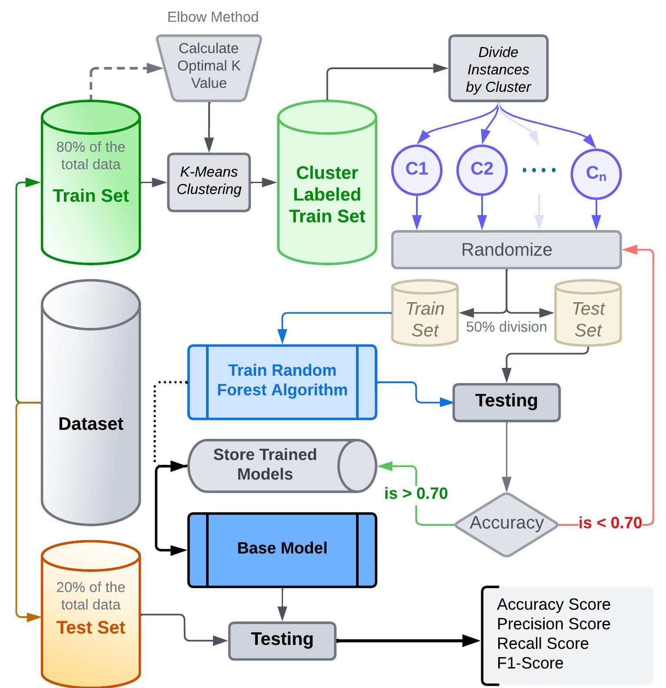

# Ameliorating Performance of Random Forest using Data Clustering

  <h3 style="color: #2c3e50; font-weight: normal; margin-bottom: 20px;">Authors</h3>
  

    <a href="mailto:umuna201429@bscse.uiu.ac.bd" style="color: #2980b9; text-decoration: none;">Ummay Maria Muna</a> • 
    <a href="mailto:sbiswas201418@bscse.uiu.ac.bd" style="color: #2980b9; text-decoration: none;">Shanta Biswas</a> • 
    <a href="mailto:szarif202009@bscse.uiu.ac.bd" style="color: #2980b9; text-decoration: none;">Syed Abu Ammar Muhammad Zarif</a> • 
    <a href="mailto:dewanfarid@cse.uiu.ac.bd" style="color: #2980b9; text-decoration: none;">Dewan Md. Farid</a>
  

---

## Abstract

Random Forest is one of the most popular supervised learning ensemble methods in machine learning. Random Forest engenders a set of random trees and considers majority voting technique to classify known and unknown data instances. In Random Forest, decision tree induction is used as a baseline classifier. 

Decision tree is a top-down divide and conquer recursive algorithm that applies feature selection technique to select the root/best feature, including:

- **ID3** (Iterative Dichotomiser 3)
- **C4.5** (an extension of ID3) 
- **CART** (Classification and Regression Tree)

<strong>Key Contribution:</strong> In this paper, we have proposed a new approach to improve the performance of Random Forest classifier using clustering technique. This proposed idea can be applied for Big Data mining.

---

## Methodology

Our approach follows a systematic two-stage process:

**Stage 1: Data Clustering**  
We cluster the data into several clusters using K-Means Clustering algorithm to create homogeneous subgroups within the dataset.

**Stage 2: Ensemble Classification**  
We apply the Random Forest technique independently to each cluster, leveraging the reduced complexity and improved data homogeneity within each cluster.

---

## System Architecture

  
   
  

    Figure 1: Proposed System Architecture
  

---

## Experimental Results

We have conducted comprehensive experiments comparing our proposed clustering-based Random Forest approach with the traditional Random Forest algorithm. The evaluation was performed on five benchmark datasets obtained from the UCI Machine Learning Repository.

<table style="width: 100%; border-collapse: collapse;">
  <tr>
    <td style="text-align: center; padding: 15px; border-right: 1px solid #bdc3c7;">
      <strong>Enhanced Performance</strong> 
      Improved accuracy over traditional RF
    </td>
    <td style="text-align: center; padding: 15px; border-right: 1px solid #bdc3c7;">
      <strong>Comprehensive Evaluation</strong> 
      Tested on 5 UCI datasets
    </td>
    <td style="text-align: center; padding: 15px;">
      <strong>Scalability</strong> 
      Suitable for Big Data applications
    </td>
  </tr>
</table>

**Key Findings:** Our proposed Random Forest technique demonstrates superior performance compared to the traditional Random Forest algorithm across all evaluated datasets, showing particular promise for large-scale data mining applications.

---

## Publication Details

  <a href="https://ieeexplore.ieee.org/document/10441376" 
     style="display: inline-block; 
            background-color: #34495e; 
            color: white; 
            padding: 12px 30px; 
            text-decoration: none; 
            border-radius: 4px; 
            font-weight: bold; 
            font-size: 16px;
            transition: background-color 0.3s ease;">
    Access Full Paper
  </a>

  

    Published in IEEE Conference Proceedings
  

